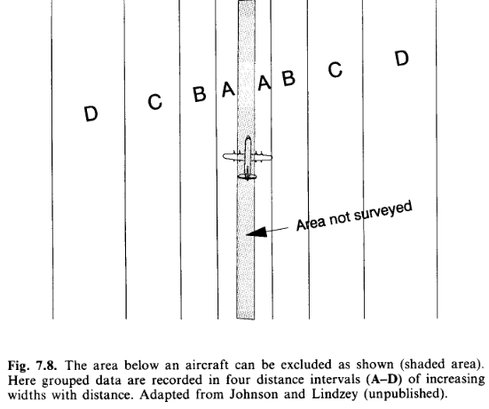

```{r setup, include=FALSE}
knitr::opts_chunk$set(echo = TRUE)
```

# Left truncation

Situations arise where detectability on/near the transect line is obscured, either because of inability to look under a survey aircraft, or because travel along the transect is difficult. One solution to such situations is to perform *left truncation* upon the distances resulting from the survey. Recognise however, detections at small distances have high information content. But these are the data that are lost through left truncation; approach such an analysis with caution.

```{r, out.width="60%", fig.cap="Downward view of aerial survey, with distance bands emanating from the transect.  Note area directly underneath plane where detections are not possible.", echo=FALSE}

```

The following are extracts from Buckland et al. [-@buckland2001], with my emphasis added describe analyses with data that are left truncated.

## 4.3.2 Left-truncation

In some surveys, such as aerial surveys with an inadequate view of the line, probability of detection on the line may be uncertain. In this instance, a histogram of the distance data will tend to show too few detections near the line. A simple solution is to offset the line, to a distance at which detection is believed to be certain. Any observations closer to the observer are then truncated. This is termed *left-truncation* because it is observations from the left end of a conventional plot of the detection function that are truncated. Another method of left-truncation is to retain the line at its original location, but to truncate data within a given distance of the line. The detection function is fitted to the remaining data, and extrapolated back to zero distance [@alldredge1985]. An example of both approaches is given in Section 8.4.3 (below).

Left-truncation is sometimes used to alleviate other problems with data on or near the line. If there are either too many or too few detections close to the line, left-truncation might be considered. However, **the reasons for the problem should be understood before a decision on whether to left truncate is made.** If there are too few detections near the line because objects move away from the observer before they are detected, then there will be too many observations further away, and left-truncation would lead to overestimation of density. Similarly, if there are too many observations close to the line because of movement towards the observer, or because perpendicular distances have been rounded to zero, then left-truncation would cause us to underestimate abundance. On the other hand, if transects are conducted along tracks (Section 7.8.5), a surfeit or deficit of detections near the line may simply reflect a higher or lower density of animals along the tracks, in which case left-truncation may yield estimates of density that are more representative of the survey region.

## 8.4.3 Nest detection in differing habitat

*This section refers to the Monte Verde duck nest data you analysed previously. However this is for nests of a different species than the data you analysed.*

Despite large sample sizes, well distributed in time and space, the ability to examine differences in detectability by vegetation type was limited by the fact that baltic rush and greasewood made up approximately 68% and 15% of the vegetation on the refuge, respectively. Initially it was hypothesized that nest detectability would decline more rapidly with distance from the centreline in the tall, but often sparse, stands of greasewood when compared to the lower, more dense areas of rush. Instead, it became clear that the histogram of grouped distance data for nests found in greasewood indicated a mode well away from the transect centreline. It was hypothesized that observers would avoid the thorny greasewood (see Fig. 8.7) by walking off line and around these shrubs. Thus, nests at the base of these shrubs tended to go undetected near the transect centreline. Nests detected at the edge of greasewood clumps would be detected with near certainty while the observer was temporarily off the centreline (and thus avoiding the greasewood). Once such a nest was found its distance to the centreline was measured and recorded. Such temporary departures from the transect centreline could explain the odd distance data for the pintail nests (Fig. 8.5). Perhaps pintail were common nesters in greasewood types and, thus, many were missed near the centreline. Indeed, 24.2% of the pintail nests were found in greasewood; surely this percentage would be still higher if nests near the centreline in greasewood were all detected. Other species nested in greasewood types less frequently: mallard 15.6%, gadwall 19.5% teal 6.9% and shoveler 2.6%. We tentatively conclude that observers were reluctant to enter the thorny greasewood type, and this resulted in nests being missed near the centreline.

```{r, fig.width=8, echo=FALSE}
# Frequencies from Fig. 8.5b, page 339 of Buckland et al. (2001)
pindist <- c(rep(0.5,8), rep(1.5,12), rep(2.5,19), rep(3.5,21),
             rep(4.5,16), rep(5.5,9), rep(6.5,10), rep(7.5,9),
             rep(8.5,6), rep(9.5,9), rep(10.5,9), rep(11.5,8))
hist(pindist, main="Histogram of pintail perpendicular distance data.", 
     nc=12, xlab="Perpendicular distance (feet)")
```

An alternative explanation is that the observer measured the distance from his or her position to the nest and that pintail tended to nest at least 2 feet into the greasewood type. Then Fig. 8.5b would arise without missing any nests near the centreline; instead, the data would arise because the observer's path would go through habitat with a low pintail nest density. In any event, the presence of obstacles such as greasewood on the line must be dealt with effectively in the field survey or the analysis of the data can be problematic. We do not always advocate that the observer plunge through such cover types; instead, extra care in searching must be taken when an easier path is temporarily followed. For example, the observer could go around clumps of such vegetation both to the left and then to the right, searching the centreline more carefully. In any event, the measurements must be taken from the transect centreline, not to the observer who may be away from the centreline.

A definitive analysis of data such as those for the pintail nests is not possible. Approximate analyses that might be useful could be considered. First, one could fit a monotonically constrained function for $g(x),$ as is shown in Fig. 8.5b for the half-normal key function with Hermite polynomial adjustments. This is likely to result in an underestimate of density if a substantial number of nests near the centreline was undetected. However, in this particular case, one knows from several other, similar species in this survey that the shape of $g(x)$ has a broad shoulder, so that the procedure might be acceptable.

Second, one could use some arbitrary left-truncation and then estimate $f(0)$ and $D$ using, for example, the uniform + cosine or half-normal + Hermite model. First, one could decide on a truncation point; 3 feet might be reasonable for the pintail nest data. Here the grouped distance data less than 3 feet could be discarded, the remaining data rescaled as if the fourth interval was actually the first interval, and proceed to estimate density in the usual way (Fig. 8.8a). This is likely to be similar to the first procedure because we have reason to suspect that the detection function for pintail nests is fairly flat. Still, in this case, some underestimation might be expected (unless $g(0) \simeq 1.0$ but nests close to zero tended to be recorded at around 3 feet; then overestimation might result).

Third, the left-truncation procedure of Alldredge and Gates (1985) could be employed, using the same truncation point. The result of this procedure is very dependent upon the model chosen and is often imprecise (Fig. 8.8b). In this example, where something is known about the distribution of distances of nests of other species of ducks, it seems likely that density of pintail nests is overestimated using this approach. Of course any left truncation decreases sample size. The results of using the three approaches for the pintail nest data are summarized in Table 8.6 for the half-normal key function and Hermite polynomial adjustments (see figure below).

The three estimates seem fairly reasonable for the pintail nest data, although one might prefer a density estimate near 30-32, rather than 35, unless the observer's path around greasewood types tended to sample areas of low pintail nest density. Considerable precision is lost in efforts to alleviate this problem; this is to be expected given the uncertainty introduced.

```{r,  fig.width=8, fig.show='hold', echo=FALSE, message=FALSE, warning=FALSE}
library(Distance)
L <- 136/0.109 # pintail num detects over encounter rate
convert <- convert_units("foot", "mile", "square mile")
pintail <- data.frame(Sample.Label=1,
                      Effort = L,
                      distance = pindist)
pin.df <- ds(pintail, convert_units = convert, adjustment="herm",
             cutpoints = seq(0, 12))
plot(pin.df, main="Unadjusted distances", showpoints=FALSE,
     xlab="Perpendicular distance (feet)")
covered <- 2* L * 12/5280  # 12 feet to miles
untruncated.density <- round(summary(pin.df)$ddf$Nhat / covered,1)
cv.original.n <- sqrt(1.7*dim(pin.df$ddf$data)[1]) / dim(pin.df$ddf$data)[1]
summary.obj <- summary(pin.df)
cv.original.p <- summary.obj$ds$average.p.se / summary.obj$ds$average.p
cv.original <- round(sqrt(cv.original.n^2 + cv.original.p^2),3)
text(8, 1.3, bquote(hat(D)==.(untruncated.density)))
text(8, 1.1, paste("CV(D)=", cv.original))
text(5.2,0.9, "pin.df <- ds(pintail, convert_units = convert, adjustment='herm',\ncutpoints = seq(0, 12))", adj=0, cex=0.8)

pin.left <- ds(pintail, convert_units = convert, adjustment = "herm",
               truncation=list(left=3, right=12), cutpoints=seq(3,12))
plot(pin.left, xlim=c(0,12), main="Left truncation of 3", showpoints=FALSE, 
     xlab="Perpendicular distance (feet)")
covered.left <- 2 * L * 9 * 1/5280
left.density <- round(summary(pin.left)$ddf$Nhat / covered.left,1)
cv.left.n <- sqrt(1.7*dim(pin.df$ddf$data)[1]) / dim(pin.df$ddf$data)[1]
summary.obj <- summary(pin.left)
cv.left.p <- summary.obj$ds$average.p.se / summary.obj$ds$average.p
cv.left <- round(sqrt(cv.left.n^2 + cv.left.p^2),3)
text(8, 1.4, bquote(hat(D)==.(left.density)))
text(8, 1.2, paste("CV(D)=", cv.left))
text(6.1,1, paste("pin.left <- ds(pintail, convert_units = convert, \nadjustment = 'herm',\ntruncation=list(left=3, right=12), cutpoints=seq(3,12))"),
     adj=0, cex=0.8)

pintail.subtract <- pintail$distance - 3
pintail.adjusted <- data.frame(Sample.Label=1,
                               Effort = L,
                               distance = pintail.subtract)
pin.subtract <- ds(pintail.adjusted, convert_units=convert, adjust="herm",
                   cutpoints=seq(0,9))
plot(pin.subtract, main="Subtract 3 from all distances", showpoints=FALSE, 
     xlab="Perpendicular distance (feet)")
subtract.density <- round(summary(pin.subtract)$ddf$Nhat / covered.left,1)
cv.subtract.n <- sqrt(1.7*dim(pin.df$ddf$data)[1]) / dim(pin.df$ddf$data)[1]
summary.obj <- summary(pin.subtract)
cv.subtract.p <- summary.obj$ds$average.p.se / summary.obj$ds$average.p
cv.subtract <- round(sqrt(cv.subtract.n^2 + cv.subtract.p^2),3)
text(5, 1.4, bquote(hat(D)==.(subtract.density)))
text(5, 1.2, paste("CV(D)=", cv.subtract))
text(2.1,1, paste("pintail.subtract <- pintail$distance - 3",
                "pintail.adjusted <- data.frame(Sample.Label=1,Effort = L,distance = pintail.subtract)",                
                "pin.subtract <- ds(pintail.adjusted, convert_units=convert, \nadjust='herm',cutpoints=seq(0,9))",
              sep="\n"), adj=0, cex=0.8)
```

## References
